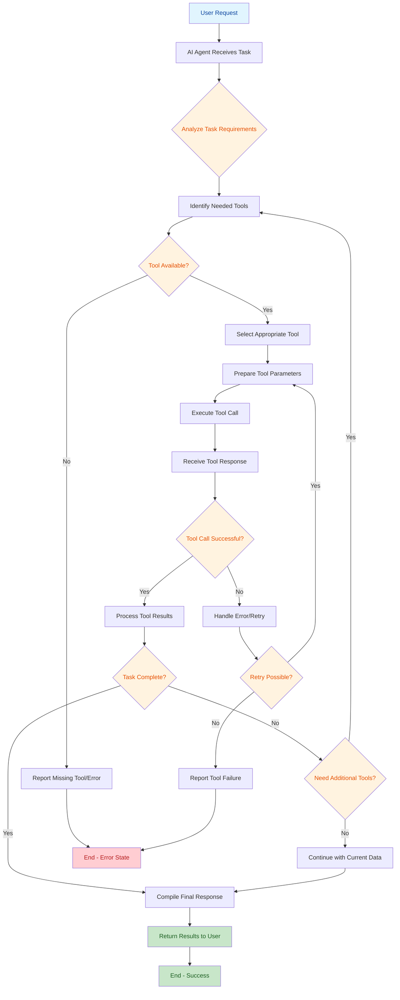
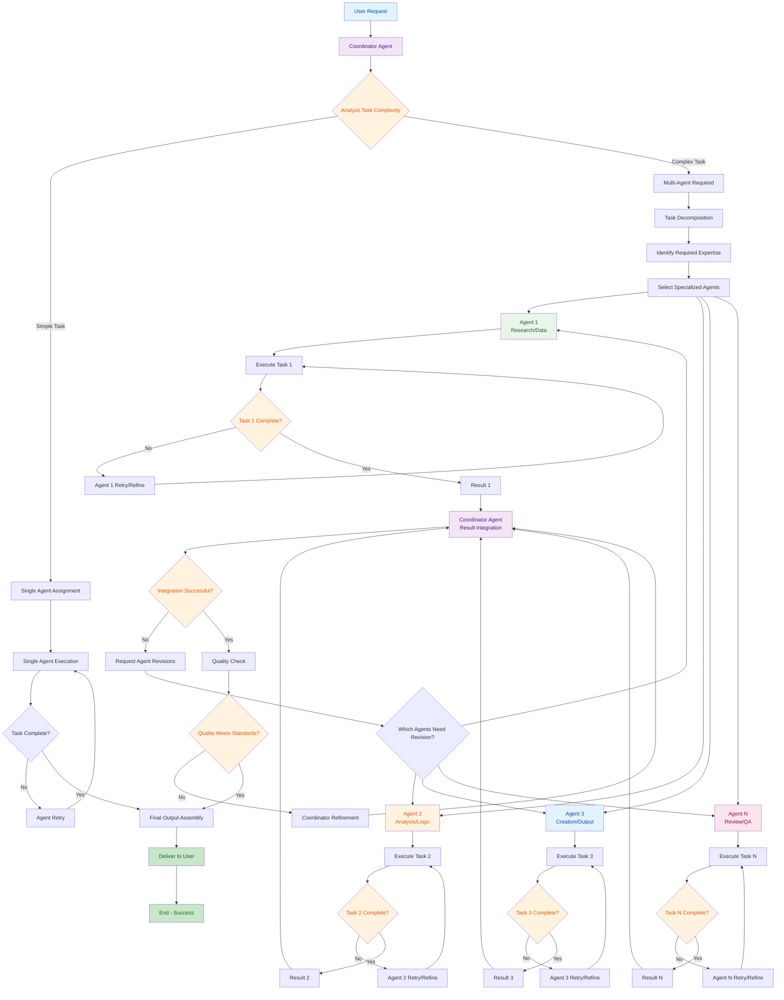

# Notes

- [Introduction](#introduction)
  - [What is AI Agents?](#what-is-ai-agents)
  - [What is Agentic AI?](#what-is-agentic-ai)
  - [What are Workflows?](#what-is-workflow)
- [AI APIs & Ollama](#ai-apis--ollama)
- [Workflow Design Patterns](#workflow-design-patterns)
  - [Prompt Chaining](#1-prompt-chaining)
  - [Routing](#routing)
  - [Parallelization](#parallelization)
  - [Orchestrator-Workers](#orchestrator-workers)
  - [Evaluator-Optimizer (or Reflection Pattern)](#evaluator-optimizer-or-reflection-pattern)
  - [Tool Use Pattern](#tool-use-pattern)
  - [Multi-Agent Collaboration](#multi-agent-collaboration)
  - [Lab: Multi Model Orchestration - Creating a system to evaluate AI responses](#lab-multi-model-orchestration---creating-a-system-to-evaluate-ai-responses)
- [Agentic AI Frameworks](#agentic-ai-frameworks)

## Introduction

### What is AI Agents?

An agent in AI is any system that can perceive its environment, reason about it, and take actions to achieve a goal.

or

AI Agents are programs where LLM outputs control the workflow.

In simple terms, an agent is like a software (or robot) that can:

- **Sense/observe** → Get inputs from the environment (e.g., user query, sensor data).
- **Think/plan** → Use reasoning or models to decide what to do next.
- **Act** → Perform actions that affect the environment (e.g., sending an API request, controlling a robot arm).

Formally:

```
Agent = Perception → Reasoning → Action → Feedback → Repeat
```

> Note: LLM ≠ AI Agent

An LLM (Large Language Model) like GPT-4 or Claude is just the "brain" - it's great at understanding and generating text, but by itself it can't take actions in the real world.

An AI Agent uses an LLM as its brain, but also has "hands and feet" to actually do things.

Think of it like this:

**LLM alone:**

- Like a very smart person who can only talk
- Can answer questions, write emails, explain concepts
- But cannot send the email, book flights, or control devices

**AI Agent:**

- Like that same smart person who can also take actions
- Uses the LLM to understand and plan
- Plus has tools to actually execute tasks

### What is Agentic AI?

Agentic AI goes beyond traditional static AI (like a single ChatGPT query-response). It refers to AI systems that act as autonomous agents, meaning they can:

- Take initiative instead of just reacting to prompts.
- Break down tasks into subtasks and execute them.
- Use tools and APIs (e.g., call a weather API, run Python code).
- Remember context over time (short-term and long-term memory).
- Plan multi-step strategies to solve complex goals.
- Collaborate with humans or other agents (multiple LLMs).
- Autonomy

In short: Agentic AI = LLM (like GPT) + memory + reasoning + tools + autonomy.

> Are "AI Agents" and "Agentic AI" the same?  
> They’re closely related, but not exactly the same.  
> Think of it like this:
>
> - AI Agent = the thing itself (the software/robot/assistant that acts).
> - Agentic AI = the capability (the idea of AI having agency — i.e., being autonomous, proactive, and able to act).
>
> So, AI Agents are the entities, while Agentic AI is the concept/approach that powers them.

### What is Workflow?

A workflow is basically a predefined sequence of steps or tasks that an agent (or a set of agents) follows to get something done.

Instead of the agent acting completely “free-form” every time, workflows give structure and repeatability.

So, **Workflows = playbooks for agents**. They don’t replace autonomy, but they give a framework in which autonomy can be applied.

**Example**

**Task:** "Order lunch for the office"
**Workflow steps:**

- Ask how many people need lunch
- Check dietary restrictions
- Search for nearby restaurants
- Compare prices and reviews
- Choose restaurant and menu items
- Place the order
- Confirm delivery time
- Send confirmation to team

**Without workflow:** The agent might do things randomly - maybe place an order before checking how many people, or forget to ask about allergies.

**With workflow:** The agent follows the logical sequence, ensuring nothing is missed and tasks are done in the right order.

Readings:

- [Building effective agents](http://anthropic.com/engineering/building-effective-agents)
- [What Are Agentic Workflows? Patterns, Use Cases, Examples, and More](https://weaviate.io/blog/what-are-agentic-workflows)

## AI APIs & Ollama

Ollama

- [Learn Ollama in 15 Minutes - Run LLM Models Locally for FREE](https://www.youtube.com/watch?v=UtSSMs6ObqY)

Openrouter

- [How to Use OpenRouter: Access Free AI Models & API Keys](https://www.youtube.com/watch?v=a_mpaNqgrGM)

How to choose LLMs: A Developer's guide to LLMs

- [How to choose LLMs: A Developer's guide to LLMs](https://www.youtube.com/watch?v=pYax2rupKEY)

## Workflow Design Patterns


### Prompt Chaining

Decomposes a task into a sequence of steps, where each LLM call processes the output of the previous one

**Example:**

- Generate marketing copy → Check if it meets brand guidelines → Translate to different language → Format for social media
- Like an assembly line where each worker adds something to the product

### Routing

Classifies an input and directs it to a specialized followup task. Here, LLM handles the routing.

**Example:**

- Customer query comes in → AI determines if it's "billing," "technical," or "general" → Routes to specialized agent
- Like a hospital receptionist directing patients to the right department

### Parallelization

LLMs can sometimes work simultaneously on a task and have their outputs aggregated **_programmatically_**. This workflow, parallelization, manifests in two key variations:

- Sectioning: Breaking a task into independent subtasks run in parallel.
- Voting: Running the same task multiple times to get diverse outputs.

As mentioned in above image, the coordinator and aggregator are the programs (may be Python or other) which initiates parallelization and process (aggregate) the result respetively.

**Example:**

- Sectioning: Review contract → One agent checks legal terms, another checks financials, third checks dates (all at once)
- Voting: Three agents independently review code for security issues, majority vote decides

### Orchestrator-Workers

A central LLM dynamically breaks down tasks, delegates them to worker LLMs, and synthesizes their results.

As mentioned in above image, orchestrator and synthesizer are your LLMs

**Example:**

- Build a website → Orchestrator decides: "Need designer for layout, developer for code writer for content" → Assigns each worker → Combines results
- Like a project manager delegating to team members

### Evaluator-Optimizer (or Reflection Pattern)

One LLM generates a response while another provides evaluation and feedback in a loop.

**Example:**

- Writer agent creates article → Critic agent reviews and suggests improvements → Writer revises → Repeat until quality threshold met
- Like having a writer and editor working together

### Tool Use Pattern



Agents access external tools and APIs to accomplish tasks.

**Example:**

- Research agent uses Google search → Wikipedia lookup → PDF reader → Database query → Email tool to send findings

### Multi-Agent Collaboration



Different specialized agents work together on complex tasks.

**Example:**

- Sales process: Lead qualifier agent → Demo scheduler agent → Proposal writer agent → Follow-up agent

Readings:

- [Building effective agents](http://anthropic.com/engineering/building-effective-agents)
- [7 Practical Design Patterns for Agentic Systems](https://www.mongodb.com/resources/basics/artificial-intelligence/agentic-systems)
- [Zero to One: Learning Agentic Patterns](https://www.philschmid.de/agentic-pattern)

### Lab: Multi Model Orchestration - Creating a system to evaluate AI responses

[LLM Contest](./code/001-week-1/002-llm-contest.py)

## Agentic AI Frameworks

### What Are Agentic AI Frameworks?

Frameworks that provide glue/abstraction code to simplify interacting with LLMs, letting developers focus on business problems rather than low-level API details. The landscape is large and evolving rapidly.

### Framework Complexity Hierarchy

#### Level 1 — No Framework (Direct API)

- Connect directly to LLMs via their APIs
- Full control over prompts and orchestration
- You see exactly what's happening under the hood
- **Anthropic's recommendation**: Their blog post _"Building Effective Agents"_ makes a compelling case for always going direct

##### MCP (Model Context Protocol)

- Created by Anthropic; grouped with "no framework" because it's a **protocol, not a framework**
- Open source standard for connecting models to data sources and tools
- No glue code needed — just conform to the protocol
- Enables elegant, vendor-agnostic stitching of models and providers

#### Level 2 — Lightweight Frameworks

| Framework             | Notes                                                                                                    |
| --------------------- | -------------------------------------------------------------------------------------------------------- |
| **OpenAI Agents SDK** | Very new, lightweight, clean, flexible. API still evolving rapidly.                                      |
| **CrewAI**            | Slightly more mature, easy to use, low-code/YAML-driven configuration, slightly heavier than OpenAI SDK. |

Both frameworks stay out of the way — you still feel like you're just working with LLMs.

#### Level 3 — Heavyweight Frameworks

| Framework     | Notes                                                                                                    |
| ------------- | -------------------------------------------------------------------------------------------------------- |
| **LangGraph** | From the LangChain team. Models agents as a computational graph. Very powerful but steep learning curve. |
| **AutoGen**   | From Microsoft. Also relatively heavy; encompasses multiple concepts/modes.                              |

With these, the **framework ecosystem takes over the project** — it becomes a "LangGraph project" more than an "agentic AI project." Greater power, but greater buy-in required.

### Choosing a Framework

Picking the right framework depends on:

- **Use case** — different platforms suit different business objectives
- **Personal/team preference** — comfort with abstractions and ecosystems
- **Trade-off appetite** — simplicity & flexibility vs. power & structure
